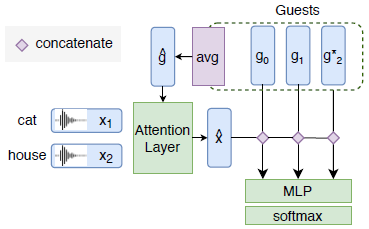
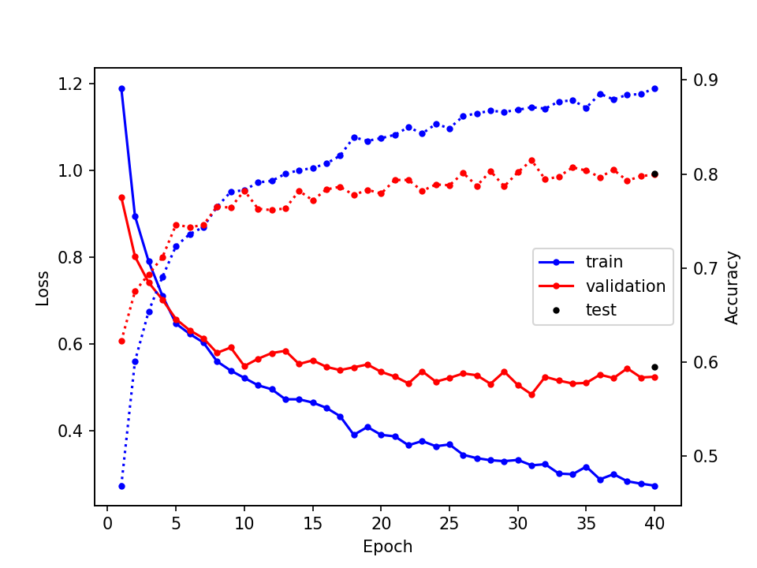

# Текущиe вопросы

## 1. Извлечение эмбеддингов X-Vector

Цитата из статьи (4.2):
> We use MFCC of dimension 20 with a frame-length of 25ms, mean-normalized over
  a sliding window of three seconds. We then process the MFCCs features through
  a pretrained X-Vector network to obtain a high-quality voice embeddings of
  fixed dimension 128, where the X-Vector network is trained on augmented
  Switchboard, Mixer 6, and NIST SREs.

При этом у X-Network нет 128-мерных выходов, эмбеддинги можно извлекать только
из входов или выходов предпоследнего линейного слоя, в обоих случаях $d = 512$.
Вероятно, в статье все-таки делалось понижение размерности с помощью LDA --
именно это делается при обучении модели, правда размерность уменьшается до 150.
На том же шаге выполняется и нормирование эмбеддингов. Я не до конца разобрался
с кодом для обучения, а мои попытки выполнить похожие операции с помощью
**NumPy** и **scikit-learn** "сломали" эмбеддинги -- guesser обучался, но
генерализация отсутствовала.

В результате я использовал именно 512-мерные эмбеддинги без каких-либо
последующих преобразований. Любопытно, что при этом точность guesser'а
оказалась существенно выше, чем в статье, подробнее об этом ниже.

## 2. Обучение guesser'a

Входные данные для 1 игры / эпизода:

| Тензор | Размерность | Описание |
|--------|-------------|----------|
| $G$ | $(K,\; d)$ | $K = 5$ эмбеддингов дикторов |
| $X$ | $(T,\; d)$ | $T = 3$ эмбеддингов записей слов, произнесенных одним из дикторов |

$d$ -- размерность эмбеддингов; id дикторов, слов и номер выбранного диктора
выбираются случайно.

Выходные данные: $K$ чисел (распределение вероятностей по дикторам).

В такой ситуации в качестве 1 сэмпла логично рассматривать 1 игру. Но это плохо
сочетается с данным в статье описанием процесса обучения (4.3):
> The guesser is trained by minimizing the cross-entropy with ADAM, a batch
  size of 1024 and an initial learning rate of $3 \cdot 10^{-4}$ over 45k games
  with five random guests.

Если батч составлен из 1024 игр, то 45 тыс. игр -- это всего лишь 45 итераций.
И вообще такой размер батча кажется необоснованно большим. Можно предположить,
что имелись в виду 45 тыс. итераций -- но такое число кажется избыточным. Для
подтверждения приведу кривые обучения для 40 эпох по 200 итераций и размере
батча 50. Т.е. в итоге получается 8 тыс. итераций и 400 тыс. игр.

Итоговая точность составляет ~80%, что существенно выше указанных в статье 74.1%.
Наверное, это связано с увеличением размерности эмбеддингов со 128 до 512,
из-за которого пропорционально увеличиваются и другие размерности. Не совсем
ясно, почему такое понижение было сделано в статье -- даже при $d = 512$ guesser
остается достаточно простой моделью, для обучения которой можно спокойно
использовать CPU.
