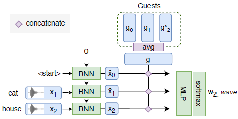
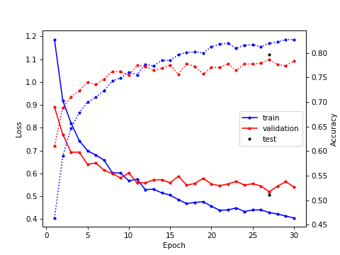
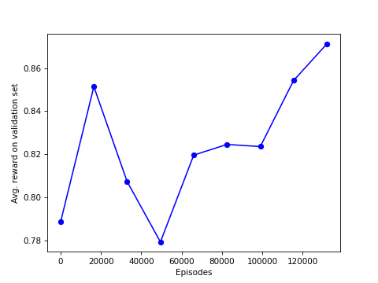

# Текущиe вопросы

## 1. Извлечение эмбеддингов X-Vector

Цитата из статьи (4.2):
> We use MFCC of dimension 20 with a frame-length of 25ms, mean-normalized over
  a sliding window of three seconds. We then process the MFCCs features through
  a pretrained X-Vector network to obtain a high-quality voice embeddings of
  fixed dimension 128, where the X-Vector network is trained on augmented
  Switchboard, Mixer 6, and NIST SREs.

При этом у X-Network нет 128-мерных выходов, эмбеддинги можно извлекать только
из входов или выходов предпоследнего линейного слоя, в обоих случаях $d = 512$.
Вероятно, в статье все-таки делалось понижение размерности с помощью LDA --
именно это делается при обучении модели, правда размерность уменьшается до 150.
На том же шаге выполняется и нормирование эмбеддингов. Я не до конца разобрался
с кодом для обучения, а мои попытки выполнить похожие операции с помощью
**NumPy** и **scikit-learn** "сломали" эмбеддинги -- guesser обучался, но
генерализация отсутствовала.

В результате я использовал именно 512-мерные эмбеддинги без каких-либо
последующих преобразований. Любопытно, что при этом точность guesser'а
оказалась существенно выше, чем в статье, подробнее об этом ниже.

## 2. Обучение guesser'a

Входные данные для 1 игры / эпизода:

| Тензор | Размерность | Описание |
|--------|-------------|----------|
| $G$ | $(K, d)$ | $K = 5$ эмбеддингов дикторов |
| $X$ | $(T, d)$ | $T = 3$ эмбеддингов записей слов, произнесенных одним из дикторов |

$d$ -- размерность эмбеддингов; id дикторов, слов и номер выбранного диктора
выбираются случайно.

Выходные данные: $K$ чисел (распределение вероятностей по дикторам).

В такой ситуации в качестве 1 сэмпла логично рассматривать 1 игру. Но это плохо
сочетается с данным в статье описанием процесса обучения (4.3):
> The guesser is trained by minimizing the cross-entropy with ADAM, a batch
  size of 1024 and an initial learning rate of $3 \cdot 10^{-4}$ over 45k games
  with five random guests.

Если батч составлен из 1024 игр, то 45 тыс. игр -- это всего лишь 45 итераций.
И вообще такой размер батча кажется необоснованно большим. Можно предположить,
что имелись в виду 45 тыс. итераций -- но такое число кажется избыточным. Для
подтверждения приведу кривые обучения для 40 эпох по 200 итераций и размере
батча 50. Т.е. в итоге получается 8 тыс. итераций и 400 тыс. игр.

Итоговая точность составляет ~80%, что существенно выше указанных в статье 74.1%.
Наверное, это связано с увеличением размерности эмбеддингов со 128 до 512,
из-за которого пропорционально увеличиваются и другие размерности. Не совсем
ясно, почему такое понижение было сделано в статье -- даже при $d = 512$ guesser
остается достаточно простой моделью, для обучения которой можно спокойно
использовать CPU.

## 3. Обучение enquirer'а

В статье напрямую не указано, какая архитектура использовалась для критика.
Я использовал аналогичную, только с 1 выходом. Другой момент -- диаграмма
выглядит так, будто для получения тензоров $\bar{x}_t$ используются выходы RNN.
Но, судя по тексту, там все же используются скрытые состояния:

> To model the enquirer, we first represent the pseudosequence
of words by feeding the X-Vectors into a bidirectional
LSTM to get the word hidden state $\bar{x}_t$ of dimension
2*128.

Входные данные для 1 игры / эпизода:

| Тензор | Размерность | Описание |
|--------|-------------|----------|
| $\hat{G}$ | $(d,)$ | усреднённые эмбеддинги дикторов |
| $X$ | $(t + 1, d)$ | эмбеддинги записей слов, произнесенных одним из дикторов + `<start>`|

Здесь $t \in \{0, 1, ..., T\}$ -- число произнесённых на данном этапе слов.
Эмбеддинг для токена `<start>` я сделал обучаемым.

Процесс обучения описан в статье следующим образом:
> The enquirer is trained by maximizing the reward encoded as the the
guesser success ratio with PPO. We use the ADAM optimizer
with a learning rate of 5e-3 and gradient clipping of 1. We performed 80k 
episodes of length T = 3 steps and K = 5 random guests.
When applying PPO, we use an entropy coefficient of 0.01,
a PPO clipping of 0.2, a discount factor of 0.9,
an advantage coefficient of 0.95, and we apply four training
batches of size 512 every 1024 transitions.

В целом все понятно, хотя все равно есть пара вопросов:

1. Что такое "advantage coefficient"? По всей видимости, имеется в виду 
используемый при расчёте $\lambda$-returns коэффициент $\lambda$. Опять
же неочевидно, зачем использовать такой вид оценки награды, когда длина эпизода
равна $3$.
2. Если каждый эпизод состоит из трёх шагов, то каким образом авторам
удается выполнять циклы обучения каждые 1024 "перехода"? Для получения награды
нужно закончить эпизод, поэтому число наборов (состояние, награда, действие,
etc) должно быть кратным 3. Можно, конечно, собрать 1026 наборов и выкинуть
последние 2, но зачем?

В результате я сделал небольшие изменения -- я собирал 990 состояний /
действий / наград / [...] и использовал 4 батча размером $\leq$ 500.
Остальные гиперпараметры я оставил без изменения, за исключением, конечно,
размерности эмбеддингов.

Первые тесты оказались неудачными -- средняя награда (равная точности
guesser'а) не изменялась как на валидационной, так и на обучающей выборке.
Мое первое предположение -- обучению агента препятствует переобученность
guesser'а на обучающей выборке (точность более 90\%). Я перезапустил обучение
guesser'а, уменьшив число эпох и добавив L2 регуляризацию. Новый график
обучения показан ниже.

Точность на val / test немного уменьшилась. К сожалению, это никак не изменило
ситуацию -- агент все ещё не обучался. После экспериментов с "игрушечной"
проблемой, удалось обнаружить баги в имплементации PPO, итоговый график
обучения enquirer'а показан ниже.

Также были сделаны 2 небольших изменения:
* на выход критика добавлена сигмоида, т.к. награда всегда лежит в диапазоне
  $[0, 1]$,
* в 10 раз уменьшен learning rate.

Видно, что, как и в статье, обучение характеризуется большим variance. Более
подробные исследования будут проведены позже.
