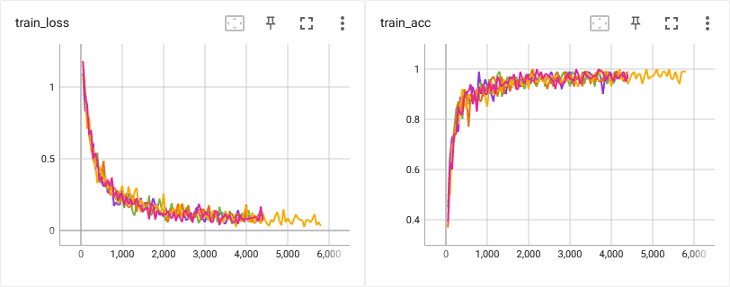
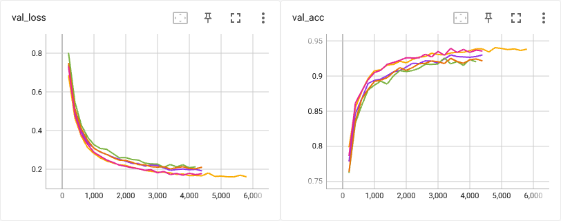
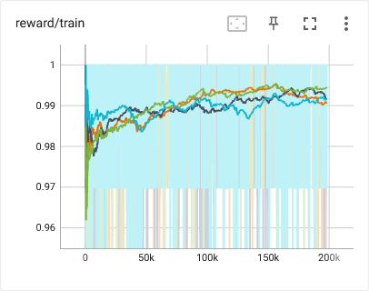
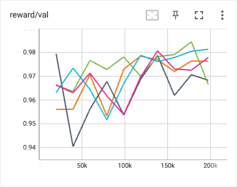
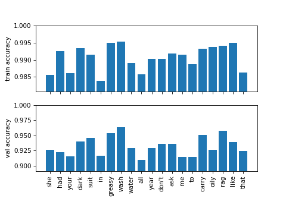
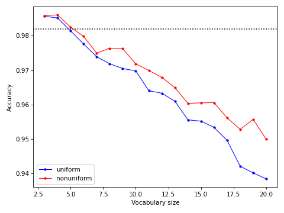

# Отчет по проделанной работе (19/04/2023)

## Обучение `Guesser`

[train_guesser.py](../src/train_guesser.py)

**Здесь и далее рассматривается режим с $K = 5$ дикторами и $T = 3$ запрашиваемыми словами, если не указано обратное.**

Единственное отличие самой модели от статьи -- увеличенная размерность
эмбеддингов (со 128 до 512). Производилась оптимизация гиперпараметров `lr`,
`batch_size` и `weight_decay`. Полученные значения здесь и далее используются в
качестве параметров по умолчанию.

Результаты для различных `seed`. В данном случае в каждом эксперименте деление
`train-val` также было различным (`test` зафиксирован создателями датасета).

| seed  | test_acc |
|:-----:|:--------:|
| 23894 | 0.933    |
| 3829  | 0.939    |
| 89349 | 0.933    |
| 12389 | 0.933    |
| 23489 | 0.933    |

При указанном по умолчанию `seed` точность на тестовой выборке составила 0.936.

## Обучение `Enquirer`

[train_enquirer.py](../src/train_enquirer.py)

Используются `Guesser`, обученный при дефолтных гиперпараметрах / `seed`,
деление `train-val` также неизменно (`--split-seed=42`). Также, как и для
`Guesser` было проверено влияние `lr` и `batch_size`, но тут есть ещё
пространство для экспериментов.

Кривые зависимостей средней награды (точности) от числа эпизодов:

| seed  | test_acc |
|:-----:|:--------:|
| 23894 | 0.984    |
| 3829  | 0.982    |
| 89349 | 0.977    |
| 12389 | 0.985    |
| 23489 | 0.983    |

Важный момент: при обучении и тестировании выходы `Enquirer` (вероятности) используются по-разному:
* `.train()` -- сэмплирование из распределения,
* `.eval()` -- `argmax` среди не запрошенных ранее слов.
Добавление запрета на повторный выбор слова позволило увеличить точность на ~1%.

## Эвристические агенты

### Оценка слов

[select_words.py](../src/select_words.py)

Для выбора слов `Guesser` был протестирован в стандартном режиме: 5 дикторов, 3 слова, случайная политика. Для каждого слова была посчитана точность среди только тех игр, в которых оно было выбрано. Результаты показаны ниже.

### Сравнение с `Enquirer`

[heuristic_agent.py](../src/heuristic_agent.py)

Принцип работы эвристического агента очень прост -- с помощью полученных ранее
оценок слов будем выбирать `k` самых удачных. Рассмотрим 2 типа агента,5
различающиеся тем, как они сэмплируют из "лучших" слов:
* `uniform` сэмплирует равномерно; `nonuniform` сэмплирует в соответствии с
* вероятностями, вычисленных из ранее полученных оценок слов по формуле
`probs = softmax(scores / temperature)`.

Сравним этих агентов с `Enquirer` в стандартном режиме (5 дикторов / 3 слова)
при различном числе выбираемых "лучших" слов.

Точность `Enquirer` обозначена пунктирной линией. Видно, что всегда выбирающий
только из 3-4 слов эвристический агент даже оказывается немного лучше.

В следующей таблице рассмотрим режимы с меньшим числом запрашиваемых слов `T`.
Здесь под детерминированным агентом подразумевается тот, который всегда
запрашивает одни и те же слова (`k=T`).

| `T` | `Enquirer` | Deterministic | Heurisic, nonuniform, `k = 8`|
|:-:|:----------:|:-------------:|:----------------------------:|
| 1 | 0.904 | 0.885 | 0.871 |
| 2 | 0.959 | 0.969 | 0.948 |
| 3 | 0.982 | 0.985 | 0.975 |
